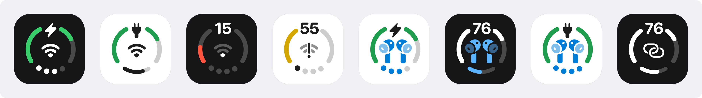
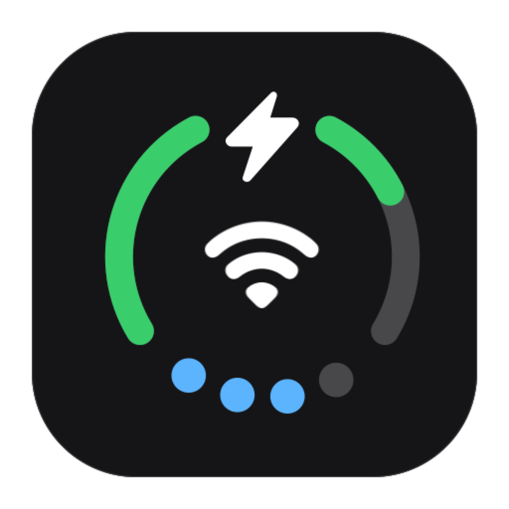
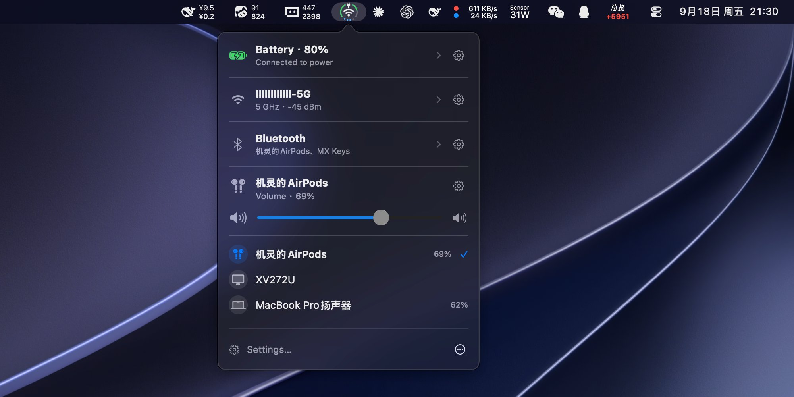
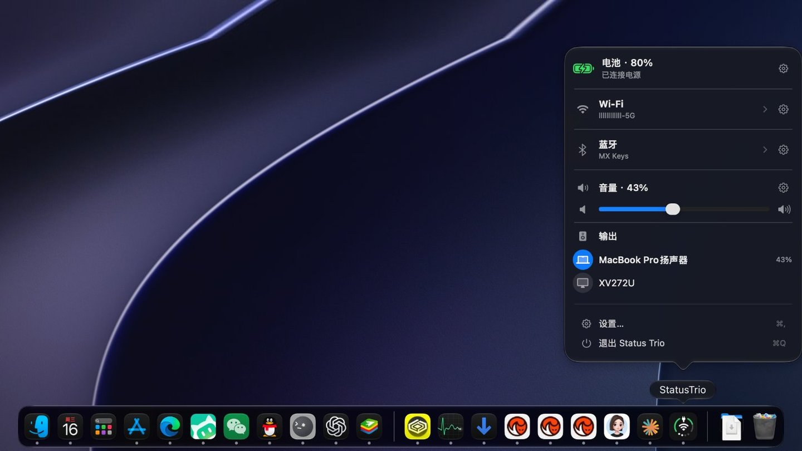
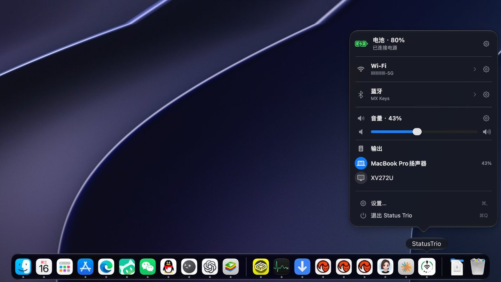
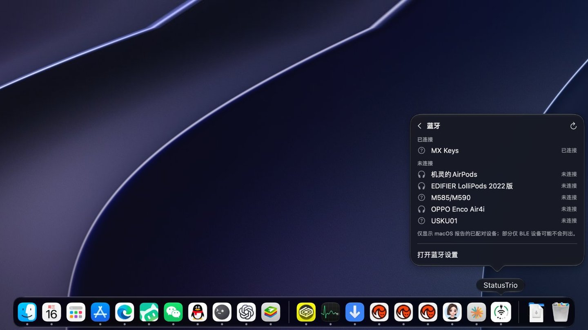
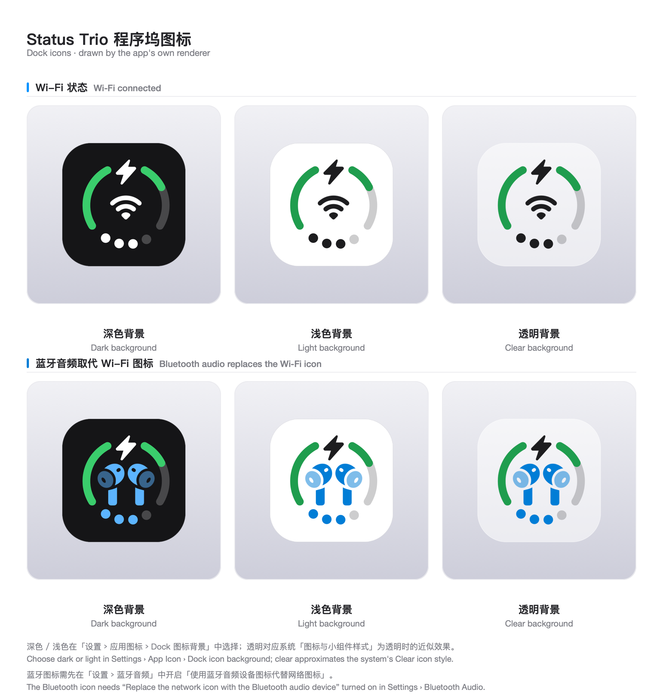
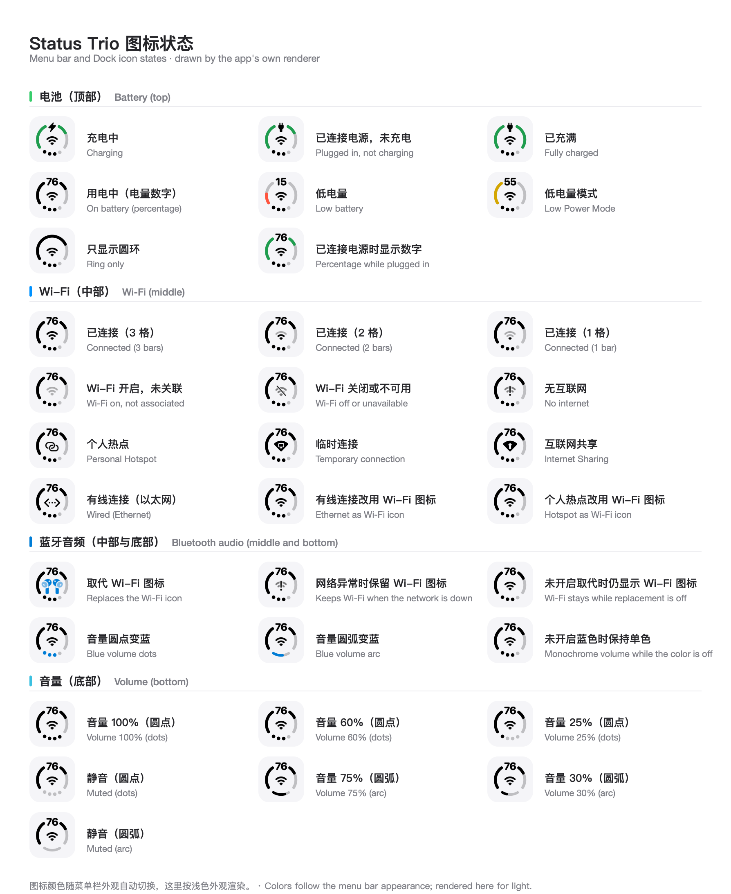
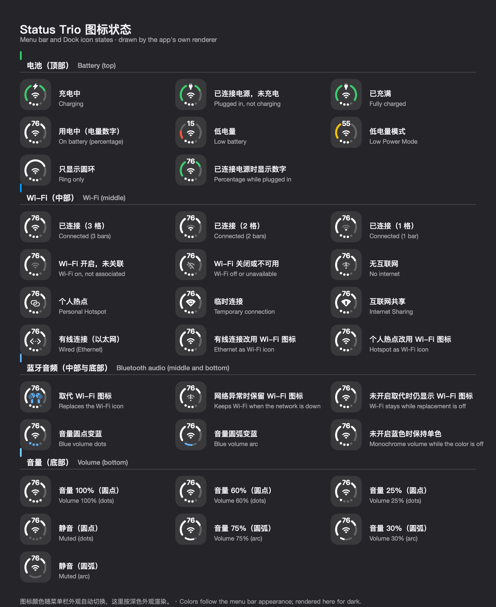

<p align="center">
  
</p>

<p align="center">
  
</p>

<h1 align="center">Status Trio</h1>

<p align="center">
  <a href="https://trendshift.io/repositories/234371?utm_source=trendshift-badge&utm_medium=badge&utm_campaign=badge-trendshift-234371" target="_blank" rel="noopener noreferrer"></a>
</p>

<p align="center"><strong>Três sinais do sistema. Um único ícone de status nativo do macOS — na sua barra de menus ou no Dock.</strong></p>

<p align="center">
  <a href="https://github.com/lingyired/status-trio/releases/latest"></a>
</p>

<p align="center">
  Quer ver como funciona antes? Abra <a href="https://statustrio.lingai.net/">statustrio.lingai.net</a> para simular todos os estados do ícone no seu navegador.
</p>

<p align="center">
  <a href="https://github.com/lingyired/status-trio/releases/latest"></a>
  <a href="https://github.com/lingyired/status-trio/actions/workflows/release.yml"></a>
  <a href="LICENSE"></a>
</p>

<p align="center">
  
  
</p>

<p align="center">
  <a href="README.md">English</a> ·
  <a href="README.zh-Hans.md">简体中文</a> ·
  <a href="README.zh-Hant.md">繁體中文</a> ·
  <a href="README.ja.md">日本語</a> ·
  <a href="README.ko.md">한국어</a> ·
  <a href="README.es.md">Español</a> ·
  <a href="README.fr.md">Français</a> ·
  <a href="README.de.md">Deutsch</a> ·
  <strong>Português (Brasil)</strong> ·
  <a href="README.ru.md">Русский</a>
</p>

<p align="center">
  
</p>

O Status Trio é um app de status nativo do macOS que reúne Wi-Fi, bateria e volume em um único ícone compacto e configurável, exibido na barra de menus, no Dock ou em ambos. Seu popover vai além do ícone: um painel de Wi-Fi para redes próximas e detalhes do link, um painel de Bluetooth para dispositivos pareados, uma página de Detalhes da bateria e os dispositivos de áudio que estão reproduzindo. Ele é inspirado no ícone combinado da barra de status do iPhone Duo para Wi-Fi, Bateria e Dados Celulares, adaptado para o Mac com Volume no lugar dos Dados Celulares.

> O Status Trio é um projeto independente e não é afiliado à Apple.

## Destaques

- **Um ícone, três sinais** — bateria, Wi-Fi e volume compartilham um único ícone na barra de menus, no Dock ou em ambos, e um dispositivo Bluetooth que está reproduzindo pode ocupar o lugar central com seu próprio símbolo.
- **Bluetooth** — o indicador de volume fica azul durante a reprodução. O painel lista os dispositivos pareados que você pode tocar para conectar ou desconectar, mostra os níveis de bateria por padrão e permanece desativado até você ativá-lo.
- **Bateria** — porcentagem, carregando ou conectado à energia, tempo para carga total e uma cor quando fica fraca. Abra a linha para ver potência do adaptador, tensão, corrente, contagem de ciclos e Modo de baixo consumo.
- **Wi-Fi** — a rede em que você está e a intensidade do sinal. Abra para ver redes próximas, conferir os detalhes do link ou desativar o Wi-Fi. A troca entre redes acontece no painel de Wi-Fi dos Ajustes do Sistema.
- **Volume** — nível, mudo e o dispositivo de saída, desenhados como pontos ou arco. Role o painel inteiro ou apenas o controle e escolha qual direção aumenta o volume.
- **Do seu jeito** — tamanho do ícone, escala do símbolo, espessura do anel, cores de status e quais seções o popover exibe, na ordem que você quiser.
- **Barra de menus, Dock ou ambos** — e o ícone do Dock pode seguir o estilo do sistema ou permanecer escuro ou claro.
- **Nativo no macOS** — o clique com o botão esquerdo abre o popover, o clique com o botão direito abre o menu, e um guia de primeira execução explica cada parte do ícone. Ethernet, um ponto de acesso pessoal ou Compartilhamento de Internet podem manter o glifo de Wi-Fi, se você preferir.
- **Sempre atualizado** — o status vem de eventos do sistema, com uma sondagem lenta como alternativa, e o Sparkle atualiza o app por um feed assinado.
- **Também incluído** — doze idiomas e a opção de abrir ao iniciar sessão.

## Áudio Bluetooth

Enquanto o áudio é reproduzido por Bluetooth, dois interruptores em **Ajustes › Bluetooth** permitem que o glifo central se torne o símbolo do próprio dispositivo — AirPods, fones de ouvido, alto-falantes e outros dispositivos fornecem o seu — e que os pontos ou o arco de volume fiquem azuis. Ambos ficam desativados por padrão. **Priorizar erros de rede**, ativado por padrão, mantém o ícone de rede enquanto a própria conexão está com problemas:

<p align="center">
  
</p>

A linha Bluetooth do popover informa o estado ao vivo: os nomes dos dispositivos conectados e, no caso dos AirPods, a bateria do esquerdo, do direito e do estojo. O painel de Bluetooth lista os dispositivos pareados e o estado de conexão deles: toque em um dispositivo para conectar e em um conectado para desconectar — teclados, mouses, trackpads e gamepads pedem confirmação primeiro, na própria linha. Ele fica desativado por padrão, é ativado em **Ajustes › Painel de status** e solicita permissão de Bluetooth no primeiro uso. **Ajustes › Bluetooth** também controla se os níveis de bateria são lidos, lista os dispositivos pareados para você arrastá-los na ordem que você quiser e escolher quantos aparecem, e ajusta o tamanho do ícone de Bluetooth de 100% a 180%.

## Ícone do Dock

O mesmo ícone ao vivo pode ficar no Dock em vez da barra de menus, ou nos dois lugares ao mesmo tempo:

<p align="center">
  
  <br>
  <sub>Ícone do Dock com aparência escura</sub>
</p>

<p align="center">
  
  <br>
  <sub>Ícone do Dock com aparência clara</sub>
</p>

<p align="center">
  
  <br>
  <sub>Prévia do painel de Bluetooth</sub>
</p>

O ícone do Dock desenha o mesmo ícone combinado da barra de menus, então, com a substituição pelo áudio Bluetooth ativada, o glifo do dispositivo também assume o centro ali. Seu fundo pode seguir o estilo de ícone do sistema ou ser fixado em um tom fixo:

<p align="center">
  
</p>

## Estados do ícone

Todos os estados que o ícone combinado pode exibir, desenhados pelo próprio renderizador do app — indicadores de bateria na parte superior, Wi-Fi (ou o dispositivo de áudio Bluetooth que pode substituí-lo, quando essa opção está ativada) no centro, e os pontos de volume ou o arco na parte inferior, ficando azuis enquanto um dispositivo Bluetooth está reproduzindo:

<p align="center">
  
</p>

Os mesmos estados renderizados para uma barra de menus escura:

<p align="center">
  
</p>

## Requisitos

- macOS 15 ou posterior para executar o app
- Toolchain do Swift 6 com o SDK do macOS 26 (Xcode 26 ou posterior) para compilá-lo. Compilar com um
  SDK mais antigo produz silenciosamente a aparência de popover anterior ao Tahoe, então `scripts/build-app.sh`
  falha quando o SDK for anterior ao 26.

## Executar a partir do código-fonte

```bash
git clone https://github.com/lingyired/status-trio.git
cd status-trio
swift run StatusTrio
```

## Compilar um app local

Compile um bundle de app assinado ad-hoc e inicie-o:

```bash
bash scripts/build-app.sh release
```

O bundle é criado em `dist/StatusTrio.app`. Para compilar sem encerrar ou iniciar uma instância existente, execute:

```bash
bash scripts/build-app.sh release no-open
```

O bundle assinado ad-hoc é destinado a uso pessoal local. O Gatekeeper pode rejeitá-lo se o bundle for transferido com metadados de quarentena.

## Instalar uma versão do GitHub

Baixe o `StatusTrio-*.dmg` mais recente na [página de versões do GitHub](https://github.com/lingyired/status-trio/releases), abra-o e copie `Status Trio.app` para `/Applications`.

A versão pública atual é assinada ad-hoc, mas não é notarizada pela Apple. O macOS pode mostrar este aviso na primeira execução:

> A Apple não pode verificar se “Status Trio” está livre de malware que possa danificar seu Mac ou comprometer sua privacidade.

Este é um aviso do Gatekeeper causado pela ausência da assinatura Developer ID e da notarização da Apple. Isso não significa, por si só, que o app contenha malware. Só ignore o aviso quando o DMG tiver sido baixado da página oficial de versões do GitHub e a soma de verificação SHA-256 publicada coincidir.

Depois de copiar o app para `/Applications`, remova o atributo de quarentena e abra-o:

```bash
xattr -dr com.apple.quarantine "/Applications/Status Trio.app"
open "/Applications/Status Trio.app"
```

Como alternativa, tente abrir o app uma vez e depois vá em **Ajustes do Sistema → Privacidade e Segurança** e escolha **Abrir Mesmo Assim**.

Não desative o Gatekeeper globalmente. As atualizações subsequentes do Sparkle são autenticadas com a chave de assinatura EdDSA do app; o comando `xattr` normalmente só é necessário na primeira instalação manual.

## Uso

- **Clique com o botão esquerdo** no ícone da barra de menus ou no ícone do Dock para abrir o popover de status.
- **Clique com o botão direito** em qualquer um dos ícones para abrir o menu nativo, incluindo as ações de versão e de sair.
- Selecione a linha de Wi-Fi ou bateria no popover para abrir a página correspondente: redes próximas e detalhes do link, ou Detalhes da bateria. A linha Bluetooth lista os dispositivos pareados ali mesmo — toque em um para conectar ou desconectar — com um controle Expandir quando não couberem todos.
- Abra os **Ajustes** para escolher onde o ícone é exibido (barra de menus, Dock ou ambos) e para alterar seu tamanho, as cores, a espessura do anel, as seções do painel e a ordem delas, o comportamento de ajuste por rolagem, o idioma, a verificação de atualizações e a opção de abrir ao iniciar sessão.
- Reabra o guia **Conheça seu ícone** a qualquer momento em **Ajustes › Ícone do app › Abrir guia**.
- Ative o nome da rede Wi-Fi atual quando solicitado; o macOS pede acesso à localização para esse detalhe opcional.

## Limitações conhecidas

Dois limites que o macOS e este projeto traçam de propósito. Ambos são explicados em [Limitações conhecidas](docs/known-limitations.md).

- **A troca entre redes acontece nos Ajustes do Sistema.** Escolher uma rede no popover abre o painel de Wi-Fi; o Status Trio nunca lê nem armazena senhas de Wi-Fi, porque o macOS não oferece nenhuma API pública para conectar-se com uma senha salva, e todas as alternativas acabam com o app guardando essas senhas.
- **“Carregar Completamente Agora” permanece no macOS.** Quando o carregamento otimizado da bateria ou um limite de carga pausa o carregamento, o popover informa o estado de pausa e leva aos ajustes de bateria; nenhuma API pública permite que um app retome o carregamento além do limite, e o Status Trio não grava no SMC nem inclui um auxiliar privilegiado para fazer isso.

## Idiomas

O Status Trio segue o idioma preferido do macOS por padrão e inclui English, 简体中文, 繁體中文, 日本語, 한국어, Español, Français, Deutsch, Italiano, Português (Brasil), Русский e العربية.

## Privacidade

O Status Trio lê o status por meio de frameworks públicos do macOS. Ele não usa App Sandbox nem exige uma permissão de rede, e não inclui telemetria ou análises. Ele não lê nem armazena senhas de Wi-Fi e nunca solicita acesso às Chaves. O acesso à localização é opcional e solicitado apenas quando você escolhe exibir o nome da rede Wi-Fi atual ou abrir os detalhes do Wi-Fi. O acesso ao Bluetooth é solicitado apenas quando você abre os detalhes do Bluetooth, e existe para mostrar o estado de conexão dos dispositivos pareados.

## Desenvolvimento

Execute a suíte de testes:

```bash
swift test
```

Execute um filtro XCTest específico pelo script auxiliar:

```bash
bash scripts/test.sh BatteryMonitorTests
```

Para compilar um app de worktree ao lado da instalação principal:

```bash
bash scripts/build-worktree.sh release
```

O script auxiliar deriva um identificador de bundle de desenvolvimento e um nome de exibição a partir da ramificação atual. Os dois valores podem ser substituídos:

```bash
BUNDLE_ID=com.lingsmbp.StatusTrio.dev.settings-redesign \
APP_NAME="Status Trio (Settings Redesign)" \
bash scripts/build-worktree.sh release
```

O bloqueio de instância única é definido pelo identificador de bundle, então builds com identificadores diferentes podem ser executados ao mesmo tempo.

## Base técnica

- Swift 6
- SwiftUI + AppKit
- macOS 15+
- `LSUIElement`: acessório da barra de menus que muda para uma política de ativação regular enquanto o ícone do Dock é exibido
- Sparkle para verificação de atualizações

## Documentação

- [Limitações conhecidas](docs/known-limitations.md)
- [Versões automatizadas do GitHub Actions](docs/github-actions-release.md)
- [Especificação de design do Status Trio](docs/superpowers/specs/2026-09-12-status-trio-design.md)
- [SVG do ícone da barra de menus](status-menubar.svg)
- [Demonstração do ícone orientada por dados](status-menubar-demo.html)

## Licença

Copyright 2026 lingyired.

Licenciado sob a Apache License, Version 2.0. Consulte [LICENSE](LICENSE) e [NOTICE](NOTICE).

## Autor

Criado e mantido por [lingyired](https://github.com/lingyired).<br>
Site: [https://statustrio.lingai.net/](https://statustrio.lingai.net/)

## Star History

<a href="https://www.star-history.com/?repos=lingyired%2Fstatus-trio&type=date&legend=top-left">
 <picture>
   <source media="(prefers-color-scheme: dark)" srcset="https://api.star-history.com/chart?repos=lingyired/status-trio&type=date&theme=dark&legend=top-left" />
   <source media="(prefers-color-scheme: light)" srcset="https://api.star-history.com/chart?repos=lingyired/status-trio&type=date&legend=top-left" />
   
 </picture>
</a>
