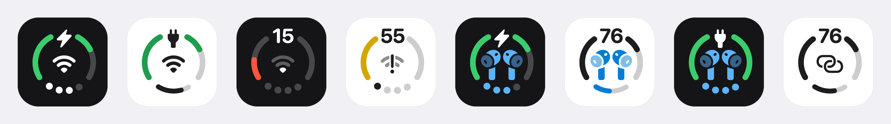

<p align="center">
  
</p>

<p align="center">
  
</p>

<h1 align="center">Status Trio</h1>

<p align="center">
  <a href="https://trendshift.io/repositories/234371?utm_source=trendshift-badge&utm_medium=badge&utm_campaign=badge-trendshift-234371" target="_blank" rel="noopener noreferrer"></a>
</p>

<p align="center"><strong>三个系统状态，一个原生 macOS 状态图标 —— 可放在菜单栏或程序坞。</strong></p>

<p align="center">
  <a href="https://github.com/lingyired/status-trio/releases/latest"></a>
</p>

<p align="center">
  想先看看实际效果？打开 <a href="https://statustrio.lingai.net/">statustrio.lingai.net</a>，即可在浏览器里模拟预览各种图标状态。
</p>

<p align="center">
  <a href="https://github.com/lingyired/status-trio/releases/latest"></a>
  <a href="https://github.com/lingyired/status-trio/actions/workflows/release.yml"></a>
  <a href="LICENSE"></a>
  <a href="https://deepwiki.com/lingyired/status-trio"></a>
</p>

<p align="center">
  
  
</p>

<p align="center">
  <a href="README.md">English</a>
</p>

<p align="center">
  
</p>

Status Trio 是一个原生 macOS 状态应用，将 Wi-Fi、电池和音量整合进一个紧凑、可配置的图标，可显示在菜单栏、程序坞，或两处同时显示。弹出面板比图标本身更深入：Wi-Fi 面板可加入网络并查看链路详情，蓝牙面板列出已配对设备，还有电池详情页，以及当前正在播放的音频设备。灵感源自 iPhone Duo 将 Wi-Fi、Battery 和 Cellular Data 合并展示的 status bar icon，并在 Mac 上以音量替代 Cellular Data。

> Status Trio 是独立项目，与 Apple 无隶属关系。

## 主要特性

- **三合一状态图标**：电池、网络和音量共用一个图标，可放在菜单栏、程序坞或两处。
- **蓝牙音频**：播放蓝牙音频时，可让设备自身的图标取代网络图标，并让音量圆点或圆弧变成蓝色，一眼看出当前输出。
- **完整电池状态**：电量百分比、充电闪电或已连接电源未充电时的插头图标、可选的已连接电源时的百分比、充满预计时间、状态颜色、可配置的低电量阈值，以及电池设置快捷入口。
- **电池详情页**：适配器功率、剩余时间、电池净功率估算、电压、电流、循环次数和低电量模式，按需采样。
- **Wi-Fi 状态识别**：以网络名称作为弹层标题，显示频段与信号强度；图标中显示信号强度与常见连接状态。
- **Wi-Fi 面板**：扫描附近网络、加入网络（密码存入钥匙串）、开关 Wi-Fi，并查看完整链路详情：BSSID、信道、信道宽度、RSSI、噪声、信噪比、PHY、速率、安全类型、IPv4/IPv6、路由器和 DNS。
- **蓝牙面板**：列出已配对设备及其连接状态，并显示 AirPods 电量。该面板默认关闭，可在**设置 › 状态面板**中开启。
- **音量一目了然**：显示输出音量、静音状态，以及当前输出设备及其在 macOS 中对应的图标。
- **滚动调节音量**：可选择在面板任意位置滚动调节，还是只在音量控件上滚动调节；还可选择向上滚动始终增大音量，不受系统自然滚动设置影响。
- **可配置渲染**：图标大小 16–36 pt（默认 24 pt）、网络与蓝牙图标缩放 100%–180%、音量圆点或连续圆弧，以及轻、标准、粗三档圆环描边。
- **可选连接图标**：可有线连接、个人热点、临时连接或互联网共享改用普通 Wi‑Fi 信号图标。
- **可自定义状态面板**：选择弹层显示哪些区块（电池、Wi-Fi、蓝牙、音量），并可拖拽调整顺序。
- **菜单栏或程序坞**：可自由选择实时图标显示在菜单栏、程序坞或两处；程序坞图标可跟随系统图标样式，也可固定为深色或浅色背景。
- **原生 macOS 交互**：在菜单栏图标或程序坞图标上左键打开状态弹层，右键显示标准菜单。
- **认识你的图标**：首次启动的引导会解释图标的每个部分，并展示常见状态组合图集。
- **高效状态更新**：事件驱动监控，并提供低频轮询兜底。
- **十二种语言**：跟随系统语言或手动选择，修改后立即生效。
- **登录时启动**：可选开机登录启动，并在 macOS 需要批准时提供引导。
- **自动更新**：Sparkle 检查已签名的 appcast，并用应用的 EdDSA 密钥校验每次更新。

## 蓝牙音频

播放蓝牙音频时，**设置 › 蓝牙**中的两个开关可以让中部图标变成该设备自身的图标（AirPods、耳机、音箱等设备各自提供自己的图标），并让音量圆点或圆弧变成蓝色。两者默认关闭。默认开启的**网络异常优先于蓝牙图标**会在连接本身异常时保留网络图标：

<p align="center">
  
</p>

弹层中的蓝牙行会显示实时状态：已连接设备的名称，以及 AirPods 的左耳、右耳和充电盒电量。蓝牙面板列出已配对设备及其连接状态，默认关闭，需在**设置 › 状态面板**中开启，首次使用会请求蓝牙权限。**设置 › 蓝牙**还可以控制是否读取电量，并把蓝牙图标在 100%–180% 之间缩放。

## 程序坞图标

同一个实时图标也可以放在程序坞，而不是菜单栏，或两处同时显示：

<p align="center">
  
  <br>
  <sub>程序坞图标（暗色外观）</sub>
</p>

<p align="center">
  
  <br>
  <sub>程序坞图标（亮色外观）</sub>
</p>

<p align="center">
  
  <br>
  <sub>蓝牙区块预览</sub>
</p>

程序坞图标绘制的是和菜单栏一致的三合一图标，开启蓝牙音频取代后，设备图标同样会取代中部图标。它的背景可以跟随系统图标样式，也可以固定为深色或浅色：

<p align="center">
  
</p>

## 图标状态

三合一图标支持的全部状态，均由应用自身的渲染器绘制 —— 顶部是电池指示，中部是 Wi-Fi 状态（开启该选项后蓝牙音频设备可取代它），底部是音量圆点或圆弧，播放蓝牙音频时会变成蓝色：

<p align="center">
  
</p>

同一批状态在深色菜单栏下的渲染：

<p align="center">
  
</p>

## 系统要求

- 运行 app 需要 macOS 15 或更高版本
- 构建需要带 macOS 26 SDK 的 Swift 6 工具链（Xcode 26 或更高版本）。用更旧的 SDK 构建会静默产出
  Tahoe 之前的弹出面板观感，因此 `scripts/build-app.sh` 在 SDK 低于 26 时会直接失败。

## 从源码运行

```bash
git clone https://github.com/lingyired/status-trio.git
cd status-trio
swift run StatusTrio
```

## 构建本地应用

构建 ad-hoc 签名的应用包并启动：

```bash
bash scripts/build-app.sh release
```

应用包位于 `dist/StatusTrio.app`。如果只想构建，不退出或启动现有实例：

```bash
bash scripts/build-app.sh release no-open
```

ad-hoc 签名的应用包适合本地个人使用。如果应用包携带 quarantine 元数据后转移，可能会被 Gatekeeper 拦截。

## 安装 GitHub Release

从 [GitHub Releases](https://github.com/lingyired/status-trio/releases) 下载最新的 `StatusTrio-*.dmg`，打开后将 `Status Trio.app` 拖入 `/Applications`。

当前公开版本使用 ad-hoc 签名，尚未经过 Apple notarization。macOS 首次启动时可能提示：

> Apple 无法验证“Status Trio”是否包含可能危害 Mac 安全或泄漏隐私的恶意软件。

这是 Gatekeeper 因缺少 Developer ID 签名和 Apple 公证而显示的警告，并不代表应用一定包含恶意软件。只有在 DMG 来自官方 GitHub Releases 页面，并且发布的 SHA-256 校验值匹配时，才应绕过此警告。

将应用复制到 `/Applications` 后，移除 quarantine 属性并启动：

```bash
xattr -dr com.apple.quarantine "/Applications/Status Trio.app"
open "/Applications/Status Trio.app"
```

也可以先尝试打开一次应用，然后前往 **系统设置 → 隐私与安全性**，选择 **仍要打开**。

不要全局关闭 Gatekeeper。后续 Sparkle 更新会通过应用的 EdDSA 签名密钥进行验证；通常只有第一次手动安装时需要执行 `xattr` 命令。

## 使用方法

- **左键点击**菜单栏图标或程序坞图标，打开状态弹层。
- **右键点击**图标，显示原生菜单，其中包含版本和退出操作。
- 在弹层中点击某一行会打开对应页面：Wi-Fi 详情与附近网络、已配对的蓝牙设备、电池详情。
- 打开**设置** —— 应用图标、电池、网络、蓝牙、音频、状态面板、通用、关于 —— 可选择图标显示位置（菜单栏 / 程序坞 / 两处），并调整图标大小、图标缩放、圆环描边、状态颜色、面板区块及其顺序、滚动调节音量行为、语言、更新检查和登录时启动。
- 可随时从**设置 › 应用图标 › 打开指引**重新查看**认识你的图标**引导。
- 如需显示当前 Wi-Fi 网络名称，请按提示启用定位权限；这是可选功能。

## 支持的语言

Status Trio 默认跟随 macOS 首选语言，支持 English、简体中文、繁体中文、日本語、한국어、Español、Français、Deutsch、Italiano、Português (Brasil)、Русский 和 العربية。

## 隐私

Status Trio 通过 macOS 公开框架读取系统状态，不使用 App Sandbox，也不需要网络权限，且不包含遥测或分析功能。定位权限为可选项，仅在用户选择显示当前 Wi-Fi 网络名称或打开 Wi-Fi 详情时请求。蓝牙权限仅在打开蓝牙详情时请求，用于显示已配对设备的连接状态。

## 开发

运行完整测试：

```bash
swift test
```

通过测试辅助脚本运行指定的 XCTest：

```bash
bash scripts/test.sh BatteryMonitorTests
```

在主应用之外运行 worktree 构建：

```bash
bash scripts/build-worktree.sh release
```

该脚本会根据当前分支生成开发版 bundle identifier 和显示名称，也可以通过环境变量覆盖：

```bash
BUNDLE_ID=com.lingsmbp.StatusTrio.dev.settings-redesign \
APP_NAME="Status Trio (Settings Redesign)" \
bash scripts/build-worktree.sh release
```

单实例锁按 bundle identifier 隔离，因此不同标识的构建可以同时运行。

## 技术基线

- Swift 6
- SwiftUI + AppKit
- macOS 15+
- `LSUIElement` 菜单栏辅助应用，显示程序坞图标时切换为常规应用策略
- 使用 Sparkle 检查更新

## 文档

- [GitHub Actions 自动发布](docs/github-actions-release.md)
- [Status Trio 设计规格](docs/superpowers/specs/2026-09-12-status-trio-design.md)
- [菜单栏图标 SVG](status-menubar.svg)
- [数据驱动图标演示](status-menubar-demo.html)

## 许可证

Copyright 2026 lingyired。

本项目采用 Apache License 2.0 许可。详见 [LICENSE](LICENSE) 和 [NOTICE](NOTICE)。

## 作者

由 [lingyired](https://github.com/lingyired) 创建并维护。<br>
主页：[https://statustrio.lingai.net/](https://statustrio.lingai.net/)
